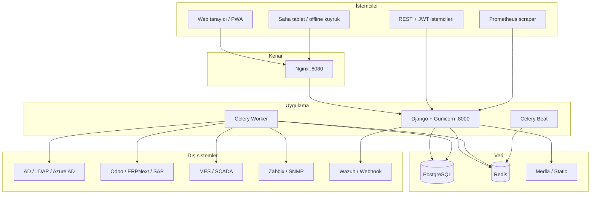
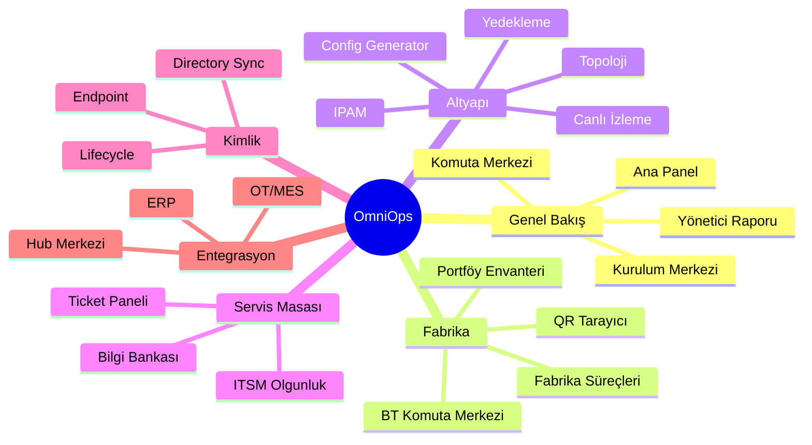
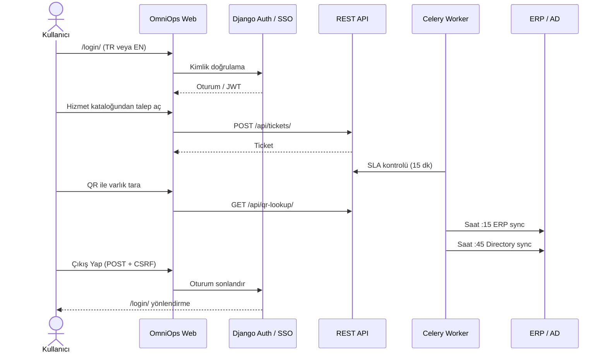
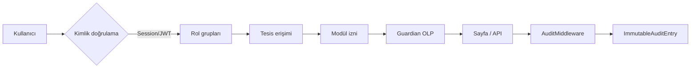

# OmniOps Factory IT Suite

**Fabrika ve kurumsal BT operasyonlarını tek panelde birleştiren açık kaynak platform.**

OmniOps; servis masası (ITSM), ağ operasyonları (ITOM), fabrika envanteri, kimlik yönetimi, entegrasyonlar, güvenlik ve raporlamayı **tek Django tabanlı uygulamada** toplar. Tekstil, gıda, otomotiv veya karma üretim tesislerinde; ticket açılışından OT/MES köprüsüne, QR varlık taramasından Prometheus metriklerine kadar uçtan uca yönetim sağlar.


---

## Hızlı özet

OmniOps, üretim ve kurumsal ortamda çalışan BT, ağ, servis masası, güvenlik ve fabrika operasyon ekiplerinin aynı platform üzerinden çalışmasını sağlar. Proje, Django tabanlı bir çekirdek üzerinde kurulu olup; ticket, envanter, ağ otomasyonu, QR tabanlı varlık takibi, ERP/OT entegrasyonları, raporlama ve denetim akışlarını tek bir veri modeli altında birleştirir.

### Ana kullanım senaryoları

- Fabrika IT ekipleri için envanter, QR etiket, doküman ve tesis bazlı operasyon yönetimi
- Ağ operasyonları için IPAM, tarama, topoloji, yedekleme ve yapılandırma üretimi
- ITSM süreçleri için ticket, SLA, bilgi bankası, kullanıcı ve servis kataloğu
- Güvenlik ve uyumluluk için denetim izi, webhook, DLP ve şifre kasası entegrasyonları
- ERP/OT/MES sistemleri ile arka planda senkronizasyon ve otomasyon

### Görsel özet


*Katmanlı mimari: istemci, uygulama, veri ve dış sistemler arasındaki akışın genel görünümü.*


*Modül grupları: genel bakış, fabrika operasyonları, altyapı, servis masası, kimlik ve entegrasyon alanları.*

### Hızlı başlangıç

1. Depoyu klonlayın.
2. Ortam değişkenlerini hazırlayın; örnek dosya olarak [.env.example](.env.example) kullanılabilir.
3. Docker Compose ile sistemi başlatın.
4. Veritabanı migrasyonlarını uygulayın.
5. Yönetici hesabı oluşturup uygulamaya giriş yapın.

```bash
git clone https://github.com/slhkrt-tech/OmniOps-Factory-It-Suite.git
cd OmniOps-Factory-It-Suite
cp .env.example .env
docker compose up --build
```

Daha detaylı kurulum ve yapılandırma talimatları için sonraki bölümleri inceleyebilirsiniz.

---

## İçindekiler

1. [OmniOps nedir?](#omniops-nedir)
2. [Görseller ve mimari](#görseller-ve-mimari)
3. [Kimler kullanır?](#kimler-kullanır)
4. [Uçtan uca kullanıcı yolculuğu](#uçtan-uca-kullanıcı-yolculuğu)
5. [Teknoloji yığını (detaylı)](#teknoloji-yığını-detaylı)
6. [Modül haritası](#modül-haritası)
7. [Veri ve güvenlik modeli](#veri-ve-güvenlik-modeli)
8. [Çoklu dil desteği (i18n)](#çoklu-dil-desteği-i18n)
9. [Kurulum](#kurulum)
10. [Entegrasyonlar](#entegrasyonlar)
11. [API](#api)
12. [Arka plan görevleri (Celery)](#arka-plan-görevleri-celery)
13. [Production kontrol listesi](#production-kontrol-listesi)
14. [Proje yapısı](#proje-yapısı)
15. [CI/CD ve doğrulama](#cicd-ve-doğrulama)

---

## OmniOps nedir?

### Çözdüğü problem

Fabrika IT ekipleri genelde **parçalı araçlar** kullanır: ayrı bir ticket sistemi, ayrı IPAM, ayrı envanter Excel’i, ERP’ye manuel veri girişi, AD’de elle kullanıcı kapatma… OmniOps bu süreçleri **tek veri modeli** ve **tek yetki katmanı** altında birleştirir.

### Ne sunar?

| Alan | OmniOps karşılığı |
|------|-------------------|
| ITSM | Ticket, SLA, hizmet kataloğu, bilgi bankası, ITSM olgunluk |
| ITOM | Ağ tarama, IPAM, topoloji, config üretici, yedekleme, canlı izleme |
| Fabrika IT | Tesis/portföy envanteri, departman kartelası, QR varlık, doküman merkezi |
| Kimlik | AD/LDAP/Azure sync, lifecycle (onboarding/offboarding), endpoint |
| Entegrasyon | Odoo, ERPNext, SAP, OT/MES, Zabbix, Teams/Slack, VMS |
| Güvenlik | DLP, denetim izi, webhook/SIEM, vault şifreleme, RBAC |
| Raporlama | PDF/CSV, yönetici özeti, Prometheus `/metrics/` |

### Temel tasarım ilkeleri

- **Tek panel, modüler sidebar** — Sektör profiline göre (tekstil, gıda, otomotiv, solar) modüller açılır/kapanır.
- **Tesis bazlı erişim** — Kullanıcı yalnızca yetkili olduğu fabrika tesislerini görür.
- **API-first** — Aynı iş kuralları web arayüzü ve REST/JWT API üzerinden çalışır.
- **Production-ready** — Docker Compose, Gunicorn, Nginx, HTTPS cookie’leri, readiness merkezi.
- **Türkçe + İngilizce** — 1500+ çeviri girdisi, dil seçici, JS i18n kataloğu.

---

## Görseller ve mimari

### Katman mimarisi


### Modül ekosistemi


### Sistem akış diyagramı



### Sidebar modül grupları (UI)



---

## Kimler kullanır?

| Rol | Django grubu | Tipik kullanım |
|-----|--------------|----------------|
| BT yöneticisi | Admin, Yönetim | Onay, rapor, readiness, entegrasyon |
| Sistem ekibi | Sistem Ekibi | Sunucu, yedek, IT envanter, kabin |
| Ağ ekibi | Ağ Ekibi | IPAM, tarama, topoloji, config push |
| Help desk | Help Desk Ekibi | Ticket, SLA, müşteri paneli |
| Son kullanıcı | — (müşteri) | Hizmet kataloğu, arıza bildirimi |
| Entegrasyon | API + JWT | ERP sync, probe agent, webhook |

**Panel yönlendirme mantığı**

- `is_staff` → Ana panel (`/`) ve yönetim modülleri
- Müşteri → Kullanıcı paneli (`/kullanici-paneli/`)
- Yetkisiz modül → Anlamlı mesaj + doğru panele yönlendirme (403 yerine UX)

---

## Uçtan uca kullanıcı yolculuğu

Aşağıdaki akış, projeyi “baştan sona” anlamak için tipik bir senaryodur.



**Adım adım özet**

1. **Giriş** — Yerel hesap, Azure AD, OIDC veya SAML (`/oauth/`).
2. **Dil seçimi** — Sağ üst TR/EN; çeviriler `locale/` + `compilemessages`.
3. **Talep** — Müşteri `user_panel`, staff `custom_admin` veya API.
4. **Operasyon** — Ağ tarama, config yedek, IPAM atama (rol + tesis kontrolü).
5. **Entegrasyon** — Celery ile ERP/AD/OT arka planda senkronize edilir.
6. **Rapor** — Yönetici özeti PDF/Word, Prometheus metrik scrape.
7. **Çıkış** — Güvenli POST logout; oturum temizlenir.

---

## Teknoloji yığını (detaylı)

Her teknoloji **neden** projede ve **ne için** kullanılıyor — satır satır.

### Backend çekirdeği

| Teknoloji | Paket / sürüm | Ne için kullanılır? |
|-----------|---------------|---------------------|
| **Python** | 3.11+ | Ana geliştirme dili; ağ otomasyonu, entegrasyon, ML-lite AIOps |
| **Django** | 5.x | Web framework: ORM, admin, auth, template, middleware, i18n |
| **Django REST Framework** | djangorestframework | REST API, ViewSet’ler, pagination, throttle |
| **SimpleJWT** | djangorestframework-simplejwt | Mobil/entegrasyon için Bearer token kimlik doğrulama |
| **drf-spectacular** | OpenAPI 3 | Swagger `/api/docs/` ve ReDoc `/api/redoc/` |
| **django-filter** | API queryset filtreleme | Cihaz/ticket listelerinde parametreli arama |
| **django-guardian** | Nesne bazlı izin (OLP) | `view_device` gibi cihaz/varlık düzeyinde yetki |
| **python-dotenv** | `.env` yükleme | Gizli anahtarların koddan ayrılması |
| **dj-database-url** | DATABASE_URL parse | SQLite (dev) ↔ PostgreSQL (prod) tek satır geçiş |
| **psycopg2-binary** | PostgreSQL sürücüsü | Production veritabanı bağlantısı |
| **gunicorn** | WSGI sunucusu | Production HTTP worker (Docker `web` servisi) |
| **whitenoise** | Statik dosya | CSS/JS manifest; Nginx olmadan da statik sunum |

### Asenkron işler

| Teknoloji | Ne için? |
|-----------|----------|
| **Celery** | Gece yedekleme, ERP sync, SLA eskalasyon, AIOps, e-posta raporu |
| **Redis** | Celery broker + result backend; yüksek frekanslı kuyruk |
| **celery.schedules (crontab)** | `core/settings.py` içinde zamanlanmış görev takvimi |

### Ağ ve altyapı otomasyonu

| Teknoloji | Ne için? |
|-----------|----------|
| **netmiko** | Cisco/Huawei SSH: config push, yedek alma, vendor tespiti |
| **scapy** | ARP broadcast, Layer-2 ağ tarama (`/ag-tarayici/`) |
| **pysnmp** | SNMP ile cihaz metrikleri (entegrasyon hub) |
| **psutil** | Localhost CPU/RAM/traffic (`/api/monitor-data/`) |
| **mac-vendor-lookup** | MAC → üretici adı (tarama sonuçları) |
| **networkx** | Topoloji graf analizi |
| **ipaddress** (stdlib) | Subnet hesaplayıcı, IPAM doğrulama |

### Belge, rapor, görsel

| Teknoloji | Ne için? |
|-----------|----------|
| **ReportLab** | PDF raporlar, yönetici özeti, QR etiket PDF |
| **Jinja2** | Vendor CLI şablonları (Cisco/Huawei config generator) |
| **Pillow** | Görsel işleme, QR/thumbnail |
| **matplotlib** | Grafik export (raporlama hub) |

### Güvenlik ve kimlik

| Teknoloji | Ne için? |
|-----------|----------|
| **cryptography (Fernet)** | `VAULT_KEY` ile SSH/API parola şifreleme |
| **PyJWT** | OnlyOffice JWT imzalama |
| **social-auth-app-django** | Azure AD, OIDC OAuth2 giriş |
| **python3-saml** | Kurumsal SAML SSO |
| **ldap3** | AD/LDAP directory sync ve lifecycle |
| **django CSRF + secure cookies** | Production’da HTTPS cookie zorunluluğu |

### Entegrasyon ve bulut

| Teknoloji | Ne için? |
|-----------|----------|
| **requests** | ERP, OT, Zabbix, webhook HTTP istemcileri |
| **boto3** | PostgreSQL dump → S3 yedekleme (opsiyonel) |

### Frontend (sunucu taraflı + statik)

| Teknoloji | Ne için? |
|-----------|----------|
| **Django Templates** | Tüm operatör panelleri; `` ile i18n |
| **Bootstrap 5** | Responsive layout, modal, dropdown, grid |
| **Iconify** | Tutarlı MDI ikon seti |
| **Chart.js + ApexCharts** | Dashboard grafikleri, heatmap |
| **SortableJS** | Widget sürükle-bırak (`workspace.js`) |
| **Leaflet** | Saha rota haritası |
| **vis-network** | Ağ topolojisi görselleştirme |
| **Service Worker + IndexedDB** | Offline saha PWA, ticket kuyruğu |
| **Custom CSS (`static/css/style.css`)** | Glass card, sidebar grupları, komut paleti |

### Veritabanı stratejisi

| Ortam | Motor | Kullanım |
|-------|-------|----------|
| Geliştirme | SQLite | `DATABASE_URL=sqlite:///db.sqlite3` — hızlı başlangıç |
| Production | PostgreSQL 15 | Docker `omniops_db`, connection pooling |
| Medya | Dosya sistemi | Yedek config, doküman, QR PDF |
| Statik | WhiteNoise + Nginx volume | `collectstatic` → paylaşımlı volume |

### Dağıtım topolojisi (Docker)

| Servis | Port | Görev |
|--------|------|-------|
| `web` (Gunicorn) | 8000 | Django uygulaması |
| `nginx` | 8080 | Reverse proxy, TLS terminasyonu (harici) |
| `worker` | — | Celery işleri |
| `beat` | — | Zamanlanmış görevler |
| `db` | 5432 (internal) | PostgreSQL |
| `redis` | 6379 (internal) | Kuyruk |
| `onlyoffice` | 8082 | DOCX/XLSX tarayıcı editörü (opsiyonel) |
| `collabora` | 9980 | WOPI alternatif editör (opsiyonel) |

---

## Modül haritası

### Komuta ve operasyon

| Modül | URL | Açıklama |
|-------|-----|----------|
| Ana Panel | `/` | KPI, ticket trend, cihaz özeti, heatmap |
| Komuta Merkezi | `/komuta-merkezi/` | VPN, kamera, iş uygulamaları |
| Yönetişim Merkezi | `/yonetisim-merkezi/` | Change calendar, CMDB, uyum |
| Kurulum Merkezi | `/kurulum-merkezi/` | Readiness skoru (%), ortam kontrolleri |
| Yönetici Özeti | `/yonetici-bilgilendirme/` | Tek sayfa PDF/Word rapor |
| Çalışma Alanı | `/calisma-alani/` | Widget sırası, sektör profili |

### Fabrika ve envanter

| Modül | URL | Açıklama |
|-------|-----|----------|
| Fabrika BT Komuta Merkezi | `/fabrika-komuta-merkezi/` | Departman kartelası, dokümanlar |
| Portföy Envanteri | `/fabrika-portfoy-envanter/` | Tesis bazlı bölüm envanteri |
| Fabrika Operasyonları | `/fabrika-operasyonlari/` | Sarf, bakım, personel IT süreçleri |
| QR Tarayıcı | `/varlik-qr-tara/` | Barkod/QR → varlık sayfası |

### Ağ ve altyapı

| Modül | URL | Açıklama |
|-------|-----|----------|
| Ağ Tarayıcı | `/ag-tarayici/` | Ping + ARP + hybrid tarama |
| IPAM | `/ipam/` | Görsel IP yönetimi |
| Topoloji | `/topoloji/` | vis-network haritası |
| Kabin / Rack | `/veri-merkezi/` | Rack elevation |
| Config Generator | `/uretici/` | Jinja2 → vendor CLI |
| Toplu Generator | `/toplu-generator/` | Celery ile toplu config push |
| Yedekleme | `/yedekleme/` | Running-config yedekleri |
| Canlı İzleme | `/monitor/` | localhost gerçek / uzak ping metrikleri |
| Port Haritası | `/port-haritasi/` | Fiziksel port bağlantıları |

### Servis masası (ITSM)

| Modül | URL | Açıklama |
|-------|-----|----------|
| Yönetim Paneli | `/panel/` | Ticket, cihaz, kullanıcı (staff) |
| Kullanıcı Paneli | `/kullanici-paneli/` | Hizmet kataloğu, talep geçmişi |
| Destek Analitik | `/destek-analitik/` | SLA, kategori performansı |
| ITSM Olgunluk | `/itsm-olgunluk/` | Problem, release, CAB, denetim |
| Bilgi Bankası | `/bilgi-bankasi/` | KB makaleleri |

### Kimlik, güvenlik, entegrasyon

| Modül | URL |
|-------|-----|
| Kimlik Operasyonları | `/kimlik-operasyonlari/` |
| DLP Olayları | `/dlp-olaylari/` |
| ERP Entegrasyonları | `/erp-entegrasyonlari/` |
| OT/MES Köprüsü | `/ot-entegrasyonlari/` |
| Entegrasyon Merkezi | `/entegrasyon-merkezi/` |
| Offline Saha | `/offline-saha/` |
| Satış Kanban | `/satis-kanban/` *(FEATURE_SALES_KANBAN)* |

### Sistem uçları

| Uç | URL | Açıklama |
|----|-----|----------|
| Health | `/health/` | Load balancer probe |
| Metrics | `/metrics/` | Prometheus scrape (token opsiyonel) |
| Global arama | `/api/global-search/` | Komut paleti (Ctrl+K) |

---

## Veri ve güvenlik modeli



| Katman | Mekanizma | Dosya / konum |
|--------|-----------|---------------|
| Kimlik | Django auth, JWT, Azure/OIDC/SAML | `social_django`, `settings.py` |
| Rol | Admin, Yönetim, Ağ, Sistem, Help Desk | `setup_helpdesk`, `role_required` |
| Tesis | `UserFactorySiteAccess` | `site_access.py` |
| Modül | `ModulePermissionGrant` | `integrations`, `governance` |
| Nesne | Guardian `assign_perm` | `view_device`, vb. |
| Vault | Fernet (`VAULT_KEY`) | `utils.encrypt_vault_password` |
| Denetim | Append-only audit | `middleware/audit_middleware.py` |
| Webhook | IP allowlist + API key | `WAZUH_API_KEY`, `device_alert_webhook` |
| Production | HSTS, secure cookies, SECRET_KEY guard | `settings.py` (DEBUG=False) |

**SSH güvenliği:** Production’da cihaz SSH bilgisi yoksa config push/yedek **reddedilir**; `admin/admin` fallback yalnızca `DEBUG=True` geliştirme ortamında.

---

## Çoklu dil desteği (i18n)

OmniOps **Türkçe (varsayılan)** ve **İngilizce** destekler.

| Bileşen | Konum | Açıklama |
|---------|-------|----------|
| Çeviri dosyaları | `locale/tr/`, `locale/en/` | GNU gettext `.po` / `.mo` |
| Manuel düzeltmeler | `locale/en_manual_overrides.json` | Kritik UI metinleri (ör. "Log Out") |
| Otomatik doldurma | `scripts/fill_i18n.py` | Eksik EN çevirileri + cache |
| JS metinleri | `inventory/i18n_js.py` → `window.OmniOpsI18n` | Komut paleti, bildirimler, offline sync |
| Şablonlar | `` | Tüm paneller |
| Dil değiştirici | Sağ üst `/i18n/setlang/` | Oturum dil tercihi |

**Çeviri güncelleme**

```bash
python manage.py makemessages -l en -l tr
python scripts/fill_i18n.py
python manage.py compilemessages
```

---

## Kurulum

### Hızlı başlangıç (Docker — önerilen)

Bu yöntem, projeyi hızlıca çalıştırmak için en basit ve tavsiye edilen yoldur. Docker kullanarak aynı anda Nginx, Django, PostgreSQL ve Celery altyapısını kurabilirsiniz.

```bash
git clone https://github.com/slhkrt-tech/OmniOps-Factory-It-Suite.git
cd OmniOps-Factory-It-Suite
copy .env.example .env   # Windows
# cp .env.example .env    # Linux/macOS
```

`.env` minimum ayarlar:

```env
APP_NAME=OmniOps
DJANGO_SECRET_KEY=replace-with-a-strong-64-char-secret
ALLOWED_HOSTS=localhost,127.0.0.1,omniops.example.com
CSRF_TRUSTED_ORIGINS=https://omniops.example.com
POSTGRES_PASSWORD=change-this-password
REMOTE_PROBE_SHARED_SECRET=change-this-probe-secret
VAULT_KEY=replace-with-fernet-key
```

```bash
docker compose up --build -d
docker compose exec web python manage.py createsuperuser
docker compose exec web python manage.py omniops_doctor --bootstrap
```

| Adres | Açıklama |
|-------|----------|
| http://127.0.0.1:8080 | Nginx (önerilen giriş) |
| http://127.0.0.1:8000 | Doğrudan Gunicorn |
| http://127.0.0.1:8000/health/ | Sağlık kontrolü |
| http://127.0.0.1:8000/api/docs/ | Swagger UI |

### Geliştirici kurulumu (yerel)

```bash
python -m venv venv
venv\Scripts\activate          # Windows
pip install -r requirements.txt
copy .env.example .env
set DATABASE_URL=sqlite:///db.sqlite3
set DJANGO_DEBUG=True
python manage.py migrate
python manage.py setup_helpdesk
python manage.py omniops_doctor --bootstrap
python manage.py createsuperuser
python manage.py runserver
```

Celery (ayrı terminaller):

```bash
celery -A core worker --loglevel=info --pool=solo
celery -A core beat --loglevel=info
```

### İlk kurulum kontrolü

Kurulum tamamlandıktan sonra aşağıdaki adreslerden sistemi doğrulayabilirsiniz:

- Web: **`/kurulum-merkezi/`** — veritabanı, gruplar, secret key, SMTP, Celery, fabrika bootstrap skoru.
- Sağlık: **`/health/`** — servis durumunu gösterir.
- API dokümanları: **`/api/docs/`** — Swagger arayüzü.

CLI:

```bash
python manage.py omniops_doctor
python manage.py omniops_doctor --json
python manage.py omniops_doctor --bootstrap
```

`--bootstrap` oluşturur: RBAC grupları, ticket kategorileri, örnek fabrika tesisleri, departman kartelası, QR etiketleri.

### Görsel kullanım örnekleri

Projenin arayüzü ve akışları aşağıdaki alanlarda öne çıkar:

- Ana panel ve komuta merkezi
- Fabrika envanteri ve QR tarayıcı
- Servis masası ve ticket akışı
- Entegrasyon merkezi ve OT/ERP bağlantıları
- Kurulum merkezi ve sağlık kontrol ekranları

> Ekran görüntüleri proje dizinindeki [docs/images/screenshots](docs/images/screenshots) klasörüne eklenerek README’de daha da zenginleştirilebilir.

---

## Entegrasyonlar

### ERP (Odoo / ERPNext / SAP)

- **URL:** `/erp-entegrasyonlari/`
- **Odoo:** XML-RPC · **ERPNext:** REST API Key · **SAP:** OData
- **CMDB sync:** `ERPExternalRecord` → envanter kalemleri
- **Zamanlama:** Celery saat `:15`

### OT / MES

- **URL:** `/ot-entegrasyonlari/`
- REST gateway veya OPC köprüsünden üretim varlıkları
- **Zamanlama:** Celery saat `:30`

### Entegrasyon Merkezi

- **URL:** `/entegrasyon-merkezi/`
- Zabbix, Prometheus, VMS (Hikvision/Milestone), Teams/Slack/webhook, IMAP ticket, backup vendor, WMS

### Kimlik (AD / LDAP / Azure)

- **URL:** `/kimlik-operasyonlari/`
- Directory sync, onboarding/offboarding lifecycle
- **Zamanlama:** Celery saat `:45`

### Belge editörleri

```bash
docker compose up -d onlyoffice collabora
```

```env
ONLYOFFICE_DOCUMENT_SERVER_URL=http://localhost:8082
ONLYOFFICE_JWT_SECRET=your-jwt-secret
DOCUMENT_EDITOR_BACKEND=onlyoffice
```

### Uzak probe agent

Şubelerdeki ağları merkeze raporlamak için `probe_agent.py` + `REMOTE_PROBE_SHARED_SECRET`.

---

## API

| Kaynak | URL |
|--------|-----|
| REST API | `/api/` |
| OpenAPI schema | `/api/schema/` |
| Swagger UI | `/api/docs/` |
| ReDoc | `/api/redoc/` |
| JWT token | `POST /api/token/` |
| JWT refresh | `POST /api/token/refresh/` |

**Kimlik doğrulama:** Session (tarayıcı) veya `Authorization: Bearer <token>` (entegrasyon).

---

## Katkı ve lisans

Projeye katkı sağlamak isterseniz:

1. Depoyu fork edin.
2. Kendi dalınızı oluşturun.
3. Değişikliklerinizi test edin ve belgeleyin.
4. Pull request açın.

Detaylı katkı rehberi için [CONTRIBUTING.md](CONTRIBUTING.md) dosyasını inceleyebilirsiniz.

Bu proje açık kaynak olarak sunulmaktadır. Kullanım koşulları ve lisans bilgileri için [LICENSE](LICENSE) dosyasını inceleyiniz.

**Öne çıkan kaynaklar:** `devices`, `tickets`, `factory-sites`, `department-inventory`, `erp-connections`, `directory-users`, `managed-documents`, `module-permissions`, `workspace/layout`

---

## Arka plan görevleri (Celery)

| Görev | Periyot | Açıklama |
|-------|---------|----------|
| Ağ taraması | 03:00 | Otomatik subnet taraması |
| SLA / lisans | 08:00 | Uyarı kontrolü |
| SLA eskalasyon | 15 dk | İhlal edilen ticketları eskale et |
| Zabbix eşik | 5 dk | CPU/RAM alarm |
| Gece yedekleme | 04:00 | Cihaz config yedekleri |
| PostgreSQL dump | 04:00 | DB yedekleme (+ S3 opsiyonel) |
| AIOps bakım | 05:00 | Tahminleyici bakım |
| Kamera health | 10 dk | NVR erişilebilirlik |
| ERP sync | Saat :15 | Tüm ERP bağlantıları |
| Directory sync | Saat :45 | AD/LDAP |
| OT sync | Saat :30 | MES/SCADA |
| Entegrasyon hub | Saat :05 | Monitoring, VMS, WMS |
| Entegrasyon health | 15 dk | HTTP endpoint kontrolü |
| Denetim raporu | Pazartesi 08:00 | Haftalık PDF e-posta |
| Veri arşivleme | Ayın 1'i | Eski logları arşivle |

Takvim: `core/settings.py` → `CELERY_BEAT_SCHEDULE`.

---

## Production kontrol listesi

- [ ] `DJANGO_SECRET_KEY` — güçlü, benzersiz (dev-only marker yok)
- [ ] `ALLOWED_HOSTS` + `CSRF_TRUSTED_ORIGINS` — canlı domain
- [ ] `DJANGO_DEBUG=False`
- [ ] `VAULT_KEY`, `REMOTE_PROBE_SHARED_SECRET`, `POSTGRES_PASSWORD` — benzersiz
- [ ] SMTP yapılandırması (`EMAIL_HOST`, …)
- [ ] SSO (Azure AD / OIDC / SAML) — kurumsal giriş
- [ ] Nginx TLS terminasyonu
- [ ] Volume yedekleme: `postgres_data`, `media_data`, `db_backups`
- [ ] `PROMETHEUS_METRICS_TOKEN` — metrikler public olmasın
- [ ] `/kurulum-merkezi/` readiness ≥ %80
- [ ] `python manage.py compilemessages` — i18n derlenmiş
- [ ] `ALLOW_PUBLIC_REGISTRATION=False`

---

## Proje yapısı

```
OmniOps/
├── core/                      # Django ayarları, Celery, URL routing
│   ├── settings.py            # Ortam değişkenleri, beat schedule, güvenlik
│   ├── urls.py                # Tüm route tanımları
│   └── celery.py              # Celery app
├── inventory/                 # Ana uygulama
│   ├── models.py              # ~100+ veri modeli
│   ├── views.py               # Ağ, envanter, raporlama, dashboard
│   ├── enterprise_views.py    # Fabrika, ITSM, entegrasyon, WOPI
│   ├── helpdesk_views.py      # Ticket, profil, bildirimler
│   ├── api_views.py           # DRF ViewSet'ler
│   ├── tasks.py               # Celery görevleri
│   ├── utils.py               # Ağ otomasyonu, vault, SNMP
│   ├── helpdesk.py            # SLA, rol, ticket kuralları
│   ├── site_access.py         # Tesis bazlı filtreleme
│   ├── workspace_registry.py  # Sektör profilleri (tekstil, gıda, …)
│   ├── i18n_js.py             # JS çeviri sözlüğü
│   ├── integrations/          # ERP, OT, AD, monitoring, OnlyOffice
│   ├── middleware/            # Denetim middleware
│   ├── management/commands/   # doctor, import, gdpr, setup_helpdesk
│   └── templates/             # HTML paneller
├── locale/                    # tr/en gettext + manual overrides
├── static/                    # CSS, JS, PWA manifest, service worker
├── scripts/                   # fill_i18n, i18n yardımcıları
├── docs/images/               # Mimari SVG görselleri
├── deploy/nginx/              # Nginx konfigürasyonu
├── docker-compose.yml         # Tam stack
├── probe_agent.py             # Uzak ağ probu
├── requirements.txt
└── .env.example
```

---

## CI/CD ve doğrulama

GitHub Actions (`.github/workflows/ci.yml`) her push/PR’da:

1. `migrate`
2. `check`
3. `makemigrations --check`
4. `spectacular --validate`
5. `test inventory` (41 test)

Yerel doğrulama:

```bash
python manage.py check
python manage.py check --deploy
python manage.py test inventory
python manage.py makemessages -l en -l tr
python scripts/fill_i18n.py
python manage.py compilemessages
python manage.py spectacular --file schema.yml --validate
```

Docker:

```bash
docker compose exec web python manage.py check
docker compose exec web python manage.py test inventory
```

---

## Yardımcı komutlar

```bash
python manage.py import_inventory_csv veriler.csv --site-code SITE-TEXTILE
python manage.py gdpr_export_user --username admin
python manage.py test_postgres_restore
python manage.py setup_helpdesk
```

---

## Lisans ve kullanım

OmniOps, fabrika IT ekipleri, sistem yöneticileri, ağ ekipleri ve destek masası operasyonları için tasarlanmıştır. Canlı kullanım öncesinde kurum politikalarına göre güvenlik, yetki, yedekleme ve log saklama ayarlarını gözden geçirin.

**Depo:** [github.com/slhkrt-tech/OmniOps-Factory-It-Suite](https://github.com/slhkrt-tech/OmniOps-Factory-It-Suite)

---

## Screenshot yer tutucular

Canlı ortam ekran görüntülerini `docs/images/screenshots/` altına ekleyebilirsiniz:

| Dosya | İçerik |
|-------|--------|
| `dashboard.png` | Ana panel KPI kartları |
| `factory-command.png` | Fabrika BT komuta merkezi |
| `network-scanner.png` | Ağ tarayıcı sonuçları |
| `ticket-panel.png` | Servis masası paneli |
| `setup-center.png` | Kurulum readiness skoru |

README’ye eklemek için:

```markdown

```
