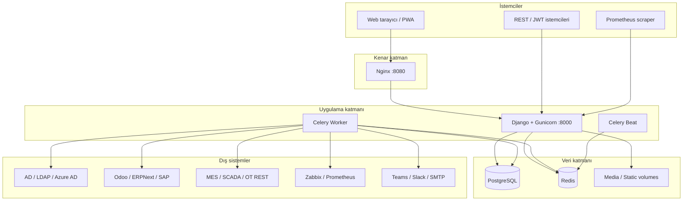

# OmniOps Factory IT Suite

OmniOps, fabrika ve kurumsal BT ekiplerinin **ITSM, ITOM, ağ yönetimi, envanter, kimlik, entegrasyon, güvenlik ve raporlama** süreçlerini tek panelde birleştiren açık kaynaklı bir operasyon platformudur.

Tekstil, gıda, otomotiv veya karma üretim tesislerinde; servis masasından OT/MES köprüsüne, fabrika portföy envanterinden Prometheus metriklerine kadar uçtan uca yönetim sağlar.


---

## İçindekiler

1. [Mimari](#mimari)
2. [Teknoloji yığını](#teknoloji-yığını)
3. [Modül haritası](#modül-haritası)
4. [Hızlı başlangıç (Docker)](#hızlı-başlangıç-docker)
5. [Geliştirici kurulumu](#geliştirici-kurulumu)
6. [İlk kurulum ve readiness](#ilk-kurulum-ve-readiness)
7. [Entegrasyonlar](#entegrasyonlar)
8. [API ve dokümantasyon](#api-ve-dokümantasyon)
9. [Güvenlik modeli](#güvenlik-modeli)
10. [Celery zamanlanmış görevler](#celery-zamanlanmış-görevler)
11. [Production kontrol listesi](#production-kontrol-listesi)
12. [Doğrulama komutları](#doğrulama-komutları)
13. [Proje yapısı](#proje-yapısı)

---

## Mimari



**Katmanlar**

| Katman | Bileşen | Görev |
|--------|---------|-------|
| Sunum | Django Templates, Bootstrap 5, Chart.js, Leaflet, vis-network | Operatör arayüzü, PWA, offline saha |
| Uygulama | Django 5, DRF, Celery | İş kuralları, API, asenkron görevler |
| Güvenlik | Guardian OLP, JWT, SSO, tesis RBAC | Rol, nesne ve tesis bazlı yetki |
| Veri | PostgreSQL (prod), SQLite (dev) | Kalıcı veri |
| Kuyruk | Redis | Celery broker ve sonuç backend |
| Dağıtım | Docker Compose, Gunicorn, Nginx, WhiteNoise | Konteyner orkestrasyonu |

---

## Teknoloji yığını

### Backend

| Teknoloji | Sürüm / Not | Kullanım |
|-----------|-------------|----------|
| Python | 3.11+ | Ana dil |
| Django | 5.x | Web framework, ORM, admin |
| Django REST Framework | — | REST API, filtreleme, pagination |
| SimpleJWT | — | API token kimlik doğrulama |
| drf-spectacular | — | OpenAPI / Swagger / ReDoc |
| django-guardian | — | Nesne bazlı izinler (OLP) |
| django-filter | — | API queryset filtreleme |
| Celery + Redis | — | Arka plan ve zamanlanmış işler |
| ldap3 | 2.9+ | AD/LDAP directory sync |
| requests | — | HTTP entegrasyon istemcileri |
| netmiko / scapy / pysnmp | — | Ağ cihaz yönetimi ve tarama |
| ReportLab | — | PDF rapor üretimi |
| boto3 | — | S3 yedekleme (opsiyonel) |
| cryptography | — | Vault alan şifreleme (Fernet) |

### Frontend

| Teknoloji | Kullanım |
|-----------|----------|
| Django Templates | Sunucu taraflı render |
| Bootstrap 5 | Responsive UI |
| Custom CSS design system | Glass card, sidebar grupları |
| Chart.js | Dashboard grafikleri |
| Leaflet | Saha rota haritası |
| vis-network | Ağ topolojisi |
| Service Worker | PWA, offline saha kuyruğu |

### Veritabanı ve depolama

| Ortam | Veritabanı | Not |
|-------|------------|-----|
| Geliştirme | SQLite | `DATABASE_URL=sqlite:///db.sqlite3` |
| Production | PostgreSQL 15 | Docker Compose `omniops_db` |
| Medya | Dosya sistemi | `media_data` volume |
| Statik | WhiteNoise + Nginx | `staticfiles_data` paylaşımlı volume |

### Dağıtım

| Bileşen | Port | Açıklama |
|---------|------|----------|
| Gunicorn (web) | 8000 | Django uygulaması |
| Nginx | 8080 | Reverse proxy, statik dosya |
| OnlyOffice | 8082 | DOCX/XLSX editör (opsiyonel) |
| Collabora | 9980 | WOPI editör (opsiyonel) |
| PostgreSQL | 5432 | Veritabanı (internal) |
| Redis | 6379 | Celery broker (internal) |

---

## Modül haritası

### Komuta ve operasyon

| Modül | URL | Açıklama |
|-------|-----|----------|
| Dashboard | `/` | KPI, ticket özeti, AIOps önerileri |
| Komuta Merkezi | `/komuta-merkezi/` | VPN, kamera, iş uygulamaları, kanallar |
| Yönetişim Merkezi | `/yonetisim-merkezi/` | Change calendar, CMDB bağımlılık, uyum |
| Kurulum Merkezi | `/kurulum-merkezi/` | Readiness skoru, ortam kontrolleri |
| Yönetici Özeti | `/yonetici-bilgilendirme/` | PDF/Word operasyon raporu |

### Fabrika ve envanter

| Modül | URL | Açıklama |
|-------|-----|----------|
| Fabrika BT Komuta Merkezi | `/fabrika-komuta-merkezi/` | Departman kartelası, doküman, alt alanlar |
| Portföy Envanteri | `/fabrika-portfoy-envanter/` | Tesis bazlı bölüm envanteri (esnek başlıklar) |
| Fabrika Operasyonları | `/fabrika-operasyonlari/` | Sarf, bakım, personel IT süreçleri |
| QR Tarayıcı | `/varlik-qr-tara/` | Barkod/QR ile varlık çözümleme |

### Ağ ve altyapı

| Modül | URL | Açıklama |
|-------|-----|----------|
| Ağ Tarayıcı | `/ag-tarayici/` | Ping/ARP/hybrid tarama |
| IPAM | `/ipam/` | Görsel IP adres yönetimi |
| Topoloji | `/topoloji/` | Ağ haritası (vis-network) |
| Kabin / Rack | `/veri-merkezi/` | Rack elevation görünümü |
| Config Generator | `/uretici/` | Vendor CLI konfigürasyon üretimi |
| Yedekleme | `/yedekleme/` | Cihaz konfig yedekleri |
| Canlı İzleme | `/monitor/` | Performans metrikleri |

### Servis masası ve ITSM

| Modül | URL | Açıklama |
|-------|-----|----------|
| Panel / Admin | `/panel/` | Ticket, cihaz, kullanıcı yönetimi |
| Destek Analitik | `/destek-analitik/` | SLA, kategori, performans |
| ITSM Olgunluk | `/itsm-olgunluk/` | Problem, release/CAB, lifecycle, denetim izi |
| Bilgi Bankası | `/bilgi-bankasi/` | KB makaleleri |

### Kimlik ve güvenlik

| Modül | URL | Açıklama |
|-------|-----|----------|
| Kimlik Operasyonları | `/kimlik-operasyonlari/` | AD/LDAP sync, lifecycle, tesis erişimi |
| DLP Olayları | `/dlp-olaylari/` | Veri kaybı önleme olayları |

### Entegrasyonlar

| Modül | URL | Açıklama |
|-------|-----|----------|
| ERP Entegrasyonları | `/erp-entegrasyonlari/` | Odoo, ERPNext, SAP OData |
| OT/MES Köprüsü | `/ot-entegrasyonlari/` | Üretim varlık senkronizasyonu |
| Entegrasyon Merkezi | `/entegrasyon-merkezi/` | Monitoring, VMS, bildirim, e-posta ticket, WMS |

### Diğer

| Modül | URL | Açıklama |
|-------|-----|----------|
| Offline Saha | `/offline-saha/` | PWA, offline kuyruk |
| Satış Kanban | `/satis-kanban/` | `FEATURE_SALES_KANBAN=True` ile aktif |
| Prometheus | `/metrics/` | Scrape metrikleri (opsiyonel token) |
| Health | `/health/` | Yük dengeleyici sağlık kontrolü |

---

## Hızlı başlangıç (Docker)

```bash
git clone https://github.com/slhkrt-tech/OmniOps-Factory-It-Suite.git
cd OmniOps-Factory-It-Suite
copy .env.example .env
```

`.env` içinde en az şu değerleri güncelleyin:

```env
APP_NAME=OmniOps
DJANGO_SECRET_KEY=replace-with-a-strong-64-char-secret
ALLOWED_HOSTS=localhost,127.0.0.1,omniops.example.com
CSRF_TRUSTED_ORIGINS=https://omniops.example.com
POSTGRES_PASSWORD=change-this-password
REMOTE_PROBE_SHARED_SECRET=change-this-probe-secret
VAULT_KEY=replace-with-fernet-key
```

Servisleri başlatın:

```bash
docker compose up --build -d
docker compose exec web python manage.py createsuperuser
docker compose exec web python manage.py omniops_doctor --bootstrap
```

Erişim:

| Adres | Açıklama |
|-------|----------|
| http://127.0.0.1:8000 | Doğrudan Gunicorn |
| http://127.0.0.1:8080 | Nginx reverse proxy (önerilen) |
| http://127.0.0.1:8000/health/ | Sağlık kontrolü |
| http://127.0.0.1:8000/metrics/ | Prometheus metrikleri |

---

## Geliştirici kurulumu

```bash
git clone https://github.com/slhkrt-tech/OmniOps-Factory-It-Suite.git
cd OmniOps-Factory-It-Suite
python -m venv venv
venv\Scripts\activate          # Windows
# source venv/bin/activate     # Linux/macOS
pip install -r requirements.txt
copy .env.example .env
set DATABASE_URL=sqlite:///db.sqlite3
python manage.py migrate
python manage.py setup_helpdesk
python manage.py omniops_doctor --bootstrap
python manage.py createsuperuser
python manage.py runserver
```

Celery (ayrı terminaller):

```bash
celery -A core worker --loglevel=info --pool=solo
celery -A core beat --loglevel=info
```

---

## İlk kurulum ve readiness

**Web:** `/kurulum-merkezi/`

**CLI:**

```bash
python manage.py omniops_doctor
python manage.py omniops_doctor --json
python manage.py omniops_doctor --bootstrap
```

`--bootstrap` şunları oluşturur: RBAC grupları, ticket kategorileri, örnek fabrika tesisleri (tekstil/gıda/otomotiv), departman kartelası, QR etiketleri.

---

## Entegrasyonlar

### ERP (Odoo / ERPNext / SAP)

- URL: `/erp-entegrasyonlari/`
- Odoo: XML-RPC · ERPNext: REST API Key · SAP: OData (`database_name` = servis yolu)
- CMDB sync: `ERPExternalRecord`, envanter kalemleri

### OT / MES

- URL: `/ot-entegrasyonlari/`
- REST gateway veya OPC köprüsünden üretim varlıkları

### Entegrasyon Merkezi

- URL: `/entegrasyon-merkezi/`
- Zabbix, Prometheus, VMS (Hikvision/Milestone), Teams/Slack/webhook, IMAP ticket, backup vendor, WMS

### Kimlik (AD / LDAP / Azure)

- URL: `/kimlik-operasyonlari/`
- Directory sync, lifecycle otomasyonu (onboarding/offboarding), tesis erişim yetkileri

### Belge editörleri

```bash
docker compose up -d onlyoffice collabora
```

```env
ONLYOFFICE_DOCUMENT_SERVER_URL=http://localhost:8082
ONLYOFFICE_JWT_SECRET=your-jwt-secret
DOCUMENT_EDITOR_BACKEND=onlyoffice
```

### Production güvenlik varsayılanları

```env
ALLOW_PUBLIC_REGISTRATION=False
SITE_ACCESS_ENFORCEMENT=True
DIRECTORY_SYNC_DRY_RUN=False
FEATURE_SALES_KANBAN=True
PROMETHEUS_METRICS_ENABLED=True
PROMETHEUS_METRICS_TOKEN=replace-with-random-token
```

Prometheus scrape (token tanımlıysa): `Authorization: Bearer <token>`

### Yardımcı komutlar

```bash
python manage.py import_inventory_csv veriler.csv --site-code SITE-TEXTILE
python manage.py gdpr_export_user --username admin
python manage.py test_postgres_restore
```

---

## API ve dokümantasyon

| Kaynak | URL |
|--------|-----|
| REST API | `/api/` |
| OpenAPI schema | `/api/schema/` |
| Swagger UI | `/api/docs/` |
| ReDoc | `/api/redoc/` |
| JWT token | `/api/token/` |
| JWT refresh | `/api/token/refresh/` |

**Öne çıkan API kaynakları:** `devices`, `tickets`, `factory-sites`, `department-inventory`, `erp-connections`, `problems`, `releases`, `monitoring-connections`, `notification-channels`, `module-permissions`

Kimlik doğrulama: Session (tarayıcı) veya JWT Bearer token (entegrasyon).

---

## Güvenlik modeli

| Katman | Mekanizma |
|--------|-----------|
| Kimlik doğrulama | Django auth, JWT, Azure AD / OIDC / SAML SSO |
| Rol bazlı | Admin, Yönetim, Ağ Ekibi, Sistem Ekibi, Help Desk |
| Nesne bazlı | django-guardian (`view_device`, vb.) |
| Tesis bazlı | `UserFactorySiteAccess`, `filter_queryset_by_site` |
| Modül bazlı | `ModulePermissionGrant` (integrations, governance, …) |
| Denetim | `ImmutableAuditEntry` (append-only), `AuditMiddleware` |
| Vault | Fernet ile API key / parola şifreleme (`VAULT_KEY`) |
| Webhook | IP allowlist + `WAZUH_API_KEY` |
| Production | HTTPS, secure cookies, HSTS, `SECRET_KEY` zorunluluğu |

---

## Celery zamanlanmış görevler

| Görev | Periyot | Açıklama |
|-------|---------|----------|
| Ağ taraması | Gece 03:00 | Otomatik subnet taraması |
| SLA / lisans | 08:00 | Uyarı kontrolü |
| SLA eskalasyon | 15 dk | İhlal edilen ticketları eskale et |
| Zabbix eşik | 5 dk | CPU/RAM alarm |
| Gece yedekleme | 04:00 | Cihaz config yedekleri |
| PostgreSQL dump | 04:00 | DB yedekleme |
| AIOps bakım | 05:00 | Tahminleyici bakım |
| Kamera health | 10 dk | NVR erişilebilirlik |
| ERP sync | Saat :15 | Tüm ERP bağlantıları |
| Directory sync | Saat :45 | AD/LDAP |
| OT sync | Saat :30 | MES/SCADA |
| Entegrasyon hub | Saat :05 | Monitoring, VMS, WMS, e-posta |
| Entegrasyon health | 15 dk | HTTP endpoint kontrolü |
| Denetim raporu | Pazartesi 08:00 | Haftalık PDF e-posta |
| Veri arşivleme | Ayın 1'i | Eski logları arşivle |

---

## Production kontrol listesi

- [ ] `DJANGO_SECRET_KEY`, `POSTGRES_PASSWORD`, `REMOTE_PROBE_SHARED_SECRET`, `VAULT_KEY` benzersiz
- [ ] `ALLOWED_HOSTS` ve `CSRF_TRUSTED_ORIGINS` canlı domain
- [ ] `DJANGO_DEBUG=False`
- [ ] SMTP: `EMAIL_HOST`, `EMAIL_HOST_USER`, `EMAIL_HOST_PASSWORD`
- [ ] SSO (Azure AD / OIDC / SAML) yapılandırması
- [ ] Nginx TLS terminasyonu
- [ ] Volume yedekleme: `postgres_data`, `media_data`, `db_backups`
- [ ] `PROMETHEUS_METRICS_TOKEN` (metrikler public olmasın)
- [ ] `/kurulum-merkezi/` readiness skoru ≥ %80

---

## Doğrulama komutları

```bash
python manage.py check
python manage.py test inventory
python manage.py makemigrations --check --dry-run
python manage.py spectacular --file schema.yml --validate
```

Docker:

```bash
docker compose exec web python manage.py check
docker compose exec web python manage.py test inventory
```

---

## Proje yapısı

```
OmniOps/
├── core/                 # Django proje ayarları, Celery, URL routing
├── inventory/            # Ana uygulama
│   ├── models.py         # Veri modelleri (~100+ model)
│   ├── views.py          # Ağ, envanter, raporlama view'ları
│   ├── enterprise_views.py  # Fabrika, ITSM, entegrasyon view'ları
│   ├── api_views.py      # DRF ViewSet'ler
│   ├── tasks.py          # Celery görevleri
│   ├── integrations/     # ERP, OT, AD, monitoring, VMS, WMS
│   ├── middleware/       # Denetim middleware
│   ├── management/       # CLI komutları (doctor, import, gdpr)
│   ├── templates/        # HTML şablonları
│   └── migrations/       # DB migration'ları
├── static/               # CSS, JS, PWA
├── deploy/nginx/         # Nginx konfigürasyonu
├── docker-compose.yml    # Tam stack (web, worker, beat, db, redis, nginx)
├── requirements.txt
└── .env.example
```

---

## Docker servisleri

| Container | Image | Görev |
|-----------|-------|-------|
| `omniops_app` | `omniops/app:latest` | Gunicorn web |
| `omniops_worker` | `omniops/app:latest` | Celery worker |
| `omniops_beat` | `omniops/app:latest` | Celery beat |
| `omniops_db` | `postgres:15-alpine` | PostgreSQL |
| `omniops_redis` | `redis:7-alpine` | Redis |
| `omniops_nginx` | `nginx:1.27-alpine` | Reverse proxy |
| `omniops_onlyoffice` | OnlyOffice (opsiyonel) | Belge editörü |
| `omniops_collabora` | Collabora (opsiyonel) | WOPI editör |

---

## Lisans ve kullanım

OmniOps, fabrika IT ekipleri, sistem yöneticileri, ağ ekipleri ve destek masası operasyonları için tasarlanmıştır. Canlı kullanım öncesinde kurum politikalarına göre güvenlik, yetki, yedekleme ve log saklama ayarlarını gözden geçirin.

**Depo:** [github.com/slhkrt-tech/OmniOps-Factory-It-Suite](https://github.com/slhkrt-tech/OmniOps-Factory-It-Suite)
